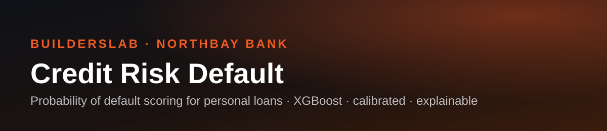

# Credit Risk Default


[](https://huggingface.co/datasets/BuildersLab/loan-application-dataset)
[](https://www.linkedin.com/company/builderslabdev)

Build an explainable machine learning credit risk platform for NorthBay Bank that predicts personal loan application defaults using origination-time borrower and loan characteristics, assists credit officers through an interactive review dashboard, and enables early intervention to reduce financial losses while minimizing unnecessary customer flags.

Built by the BuildersLab team for NorthBay Bank, a fictional bank case study.


---

## What this project does

- Cleans and target-filters 1.3M+ LendingClub loan records (2007-2018), removing post-origination leakage columns so only information available at application time is used.
- Engineers features (credit history length, FICO midpoint, affordability ratios, ordinal encodings) and compares six candidate models (Logistic Regression, Random Forest, KNN, XGBoost, LightGBM, CatBoost) on ROC-AUC, the primary metric (see [`docs/decisions.md`](docs/decisions.md)), with PR-AUC and accuracy reported alongside for the ~20% default rate.
- Explains what drives the model's predictions with SHAP values (global feature importance today; a per-prediction, plain-English rationale via the Gemini API is planned, but not yet connected, advisory only, never the deciding signal, when it lands).
- Surfaces the model through an interactive Streamlit dashboard where a credit officer scores a loan application, sees the predicted default risk and tier, and records a monitoring decision.

## Live demo

[portfolio-risk-prediction.streamlit.app](https://portfolio-risk-prediction.streamlit.app/): public, no login required

---

## Team

| Name | Role |
|---|---|
| Nafisat Ibrahim | Data Scientist & Project Lead |
| Marienne Dosso | Data Scientist |
| Bintou Ba | Data Scientist |

---

## Quickstart

```bash
git clone https://github.com/builderslab/Credit-Risk-Default.git
cd Credit-Risk-Default
make setup
```

Data loads directly from Hugging Face inside the notebooks (`datasets.load_dataset("BuildersLab/loan-application-dataset")`), no manual download needed. See [docs/setup_guide.md](docs/setup_guide.md) for full instructions.

The `src/` pipeline scripts (`make data` / `make train` / `make evaluate`) are still under active development and don't yet run end-to-end. The actual working pipeline today is the notebook sequence below, run in order, each one loads its input from Hugging Face and pushes its output back there:

1. `notebooks/00_cleaning.ipynb`, cleaning, target definition, leakage removal
2. `notebooks/02_feature_engineering.ipynb`, feature engineering, encoding
3. `notebooks/03_modeling.ipynb`, model comparison, tuning, calibration, the final selected model

The dashboard is fully working and pulls the trained model straight from Hugging Face, no local pipeline run required to use it:

```bash
make app       # launch dashboard
```

---

## Repo structure

```
Credit-Risk-Default/
├── data/
│   ├── raw/                  # original files, never edited, gitignored
│   ├── processed/            # pipeline outputs, gitignored
│   └── DATA_CARD.md
├── notebooks/
│   ├── 00_cleaning.ipynb
│   ├── 01_eda.ipynb
│   ├── 02_feature_engineering.ipynb
│   ├── 03_modeling.ipynb
│   ├── 04_explainability.ipynb
│   └── 10_add_data_to_huggingface.ipynb
├── outputs/                   # charts, tables, correlation matrices, mirrored to Hugging Face
├── assets/
│   └── images/
├── src/
│   ├── data_pipeline.py       # in progress, not yet functional end-to-end
│   ├── features.py            # in progress
│   ├── train.py               # in progress
│   ├── evaluate.py            # in progress
│   ├── explain.py             # in progress
│   ├── predict.py             # in progress
│   ├── gemini.py             # optional: remove if not using Gemini
│   ├── prompts.py            # optional: remove if not using Gemini
│   ├── upload_to_hf.py               # pushes the raw/cleaned dataset to Hugging Face
│   ├── upload_model_to_hf.py         # pushes the final model bundle to Hugging Face
│   └── upload_modeling_outputs_to_hf.py  # pushes charts/tables from 03_modeling.ipynb to Hugging Face
├── models/
│   └── MODEL_CARD.md
├── app/
│   ├── app.py                # the working Streamlit dashboard, pulls the model from Hugging Face
│   ├── requirements.txt
│   ├── README.md
│   └── .streamlit/
├── tests/
├── docs/
├── .github/
├── .env.example
├── Makefile
└── pyproject.toml
```

---

## Key results

Final model: XGBoost, 49 selected features, calibrated (Platt scaling). Test set, 201,802 loans, at the cost-optimal operating threshold (0.155, false negatives weighted 5x a false positive). See [`app/app.py`](app/app.py)'s Project Details page for the full breakdown, SHAP charts, and model comparison.

| Metric | Value |
|---|---|
| ROC-AUC | 0.736 |
| PR-AUC | 0.414 |
| Recall at threshold | 77.9% |
| Precision at threshold | 30.2% |
| False positive rate | 44.9% |

---

## Documentation

- [Data Card](data/DATA_CARD.md)
- [Model Card](models/MODEL_CARD.md)
- [Setup Guide](docs/setup_guide.md)
- [Workflow and PR conventions](docs/workflow.md)
- [Decision log](docs/decisions.md)
- [Notion workspace](https://www.notion.so/builderslab/Credit-Risk-Scoring-System-360663a5d5d180b18f73d93d27db9c42)
